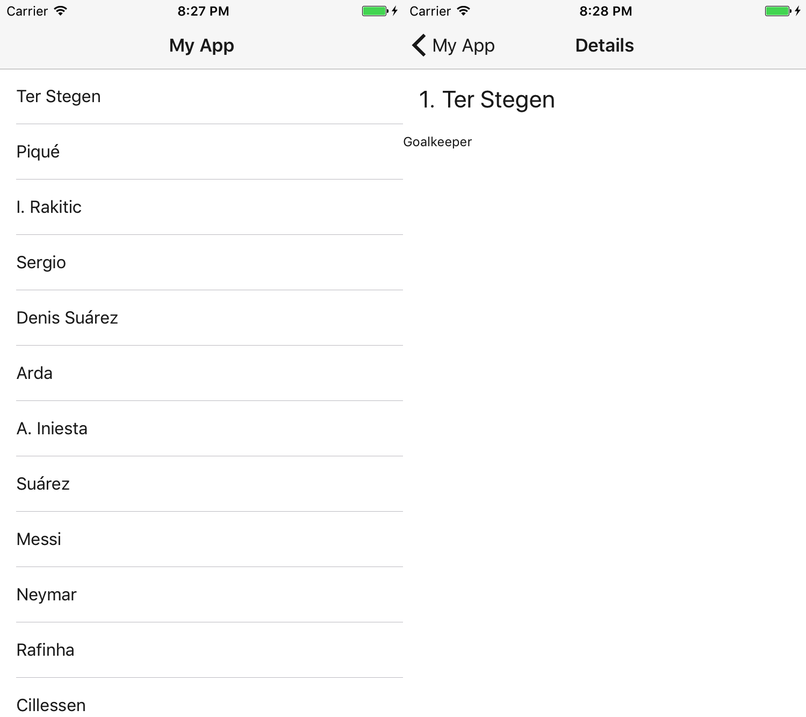
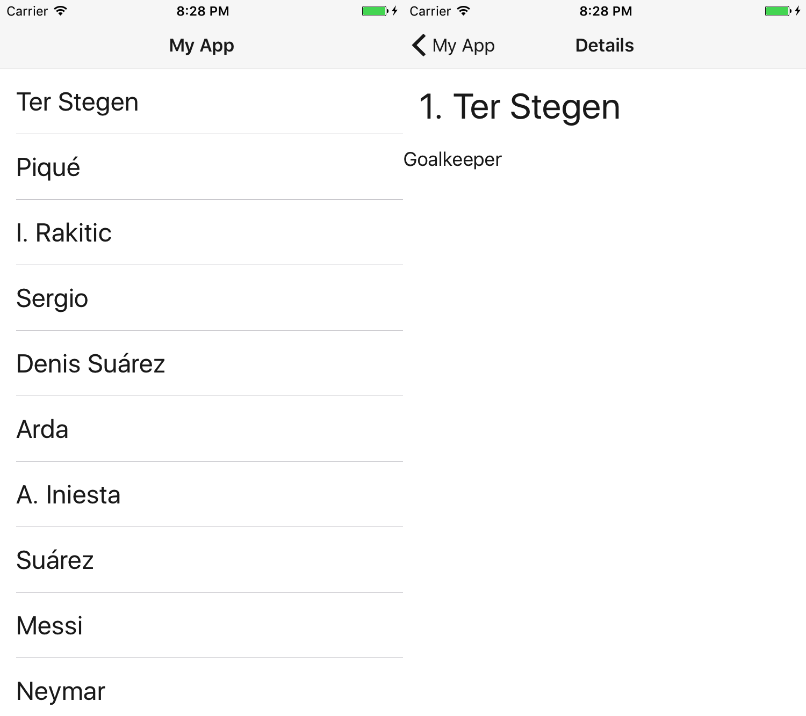
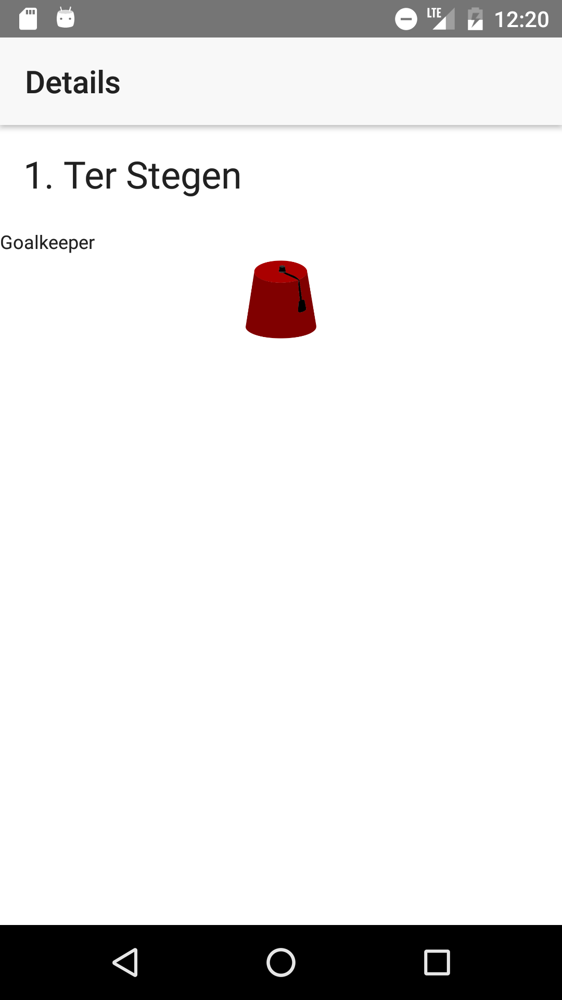
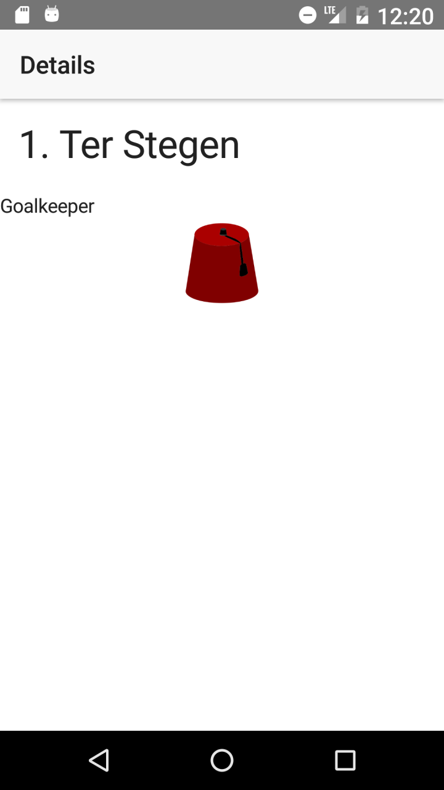

# Scaling all the texts

As apart of the process of making our apps more accessible, we want to scale the text so the visually impaired.

On Android the texts on labels and buttons is scaled automatically, we don't need to do anything to support it. We might want to fix the layout when this happens.

On iOS on the other hand doesn't scale the text automatically, on iOS 10+  *adjustsFontForContentSizeCategory* can be used on a UILabel to have it scaled.
Unfortunately this only works for prefered fonts. which is difficult to set from NativeScript.

Luckily [@nota/nativescript-accessiblity-ext](https://www.npmjs.com/package/@nota/nativescript-accessibility-ext) just added supports font scaling via CSS.

## Getting started

Start by creating a new NativeScript project. I'm using Angular, but it will work just as well with NativeScript Core.

```bash
tns create projectname --ng

cd projectname
npm i
npm i --save-dev nativescript-dev-sass
npm i --save @nota/nativescript-accessibility-ext@^3.0.0-alpha.7 nativescript-globalevents
```

Create the SCSS files for the [nativescript-theme-core](https://docs.nativescript.org/ui/theme#sass-usage)

### app/_app.common.scss
```sass
// Import the theme’s variables. If you’re using a color scheme
// other than “light”, switch the path to the alternative scheme,
// for example '~nativescript-theme-core/scss/dark'.
@import '~nativescript-theme-core/scss/light';

// Customize any of the theme’s variables here, for instance $btn-color: red;

// Import the theme’s main ruleset.
@import '~nativescript-theme-core/scss/index';

// Place any CSS rules you want to apply on both iOS and Android here.
// This is where the vast majority of your CSS code goes.
```

### app/app.android.scss
```sass
@import 'app-common';
@import '~nativescript-theme-core/scss/platforms/index.android';
```

### app/app.ios.scss
```sass
@import 'app-common';
@import '~nativescript-theme-core/scss/platforms/index.ios';
```

Now import the a11y-scss from **@nota/nativescript-accessiblity-ext**:

Add this to `app/app.ios.scss`:
```sass
@import '~@nota/nativescript-accessibility-ext/scss/a11y.ios';
```

Now we need to load import the plugin in our `app/app.module.ts`

Add this:
```typescript
import { NgModule, NO_ERRORS_SCHEMA } from "@angular/core";
import { NativeScriptModule } from "nativescript-angular/nativescript.module";
import '@nota/nativescript-accessibility-ext'; // <-- add this line
```

## Screenshots

### Text not scaled - iOS



### Text scaled to 150% of normal - iOS



## How does this work?

**@nota/nativescript-accessibility-ext** adds a class to the page matching the current font-scale setting:
```
- a11y-fontscale-50 *(iOS only)*
- a11y-fontscale-70 *(iOS only)*
- a11y-fontscale-85
- a11y-fontscale-100
- a11y-fontscale-115
- a11y-fontscale-130
- a11y-fontscale-150 *(iOS only)*
- a11y-fontscale-200 *(iOS only - extra large fonts)*
- a11y-fontscale-250 *(iOS only - extra large fonts)*
- a11y-fontscale-300 *(iOS only - extra large fonts)*
- a11y-fontscale-350 *(iOS only - extra large fonts)*
- a11y-fontscale-400 *(iOS only - extra large fonts)*
```

These classes are used to override the classes from **nativescript-theme-core** like this.

```css
Page.a11y-fontscale-150 {
  .t-10 {
    font-size: 15; /* 10 * 150% = 15 */
  }
}
```

This is done for all the CSS-classes in **nativescript-theme-core** which touches on font-size.

# Adding your own scaling style

If you use your own classes or you need to fix the layout when the text is scaled, you can easily do this yourself.

## Enable listening for config changes on Android.

If you need to make adjustments on Android, you need to make a small change to your `app/App_Resources/Android/AndroidManifest.xml`.

Add **fontScale** to the `android:configChanges`-attribute on the `<activity>`.

The line:
```
	android:configChanges="keyboardHidden|orientation|screenSize"
```
Becomes:
```
	android:configChanges="keyboardHidden|orientation|screenSize|fontScale"
```

## Writing your own style

Here I'll scale an image.

Downloade the small image of [a cool fez](https://openclipart.org/detail/276028/fez-hat) and save it to `app/fezzes-are-cool.png`.

Edit the file `app/_app-common.scss`.
```scss
@import '~@nota/nativescript-accessibility-ext/scss/fontscales';

@each $scale, $scales in $a11y-font-scales {
  $factor: map-get($scales, factor);

  $base-size: 50;
  Page.a11y-fontscale-#{$scale} {
    .scaled-image {
      height: $base-size * $factor;
      width: $base-size * $factor;
    }
  }
}
```

Edit the file `app/item/items.component.html`
```html
<ActionBar title="Details" class="action-bar"></ActionBar>
<FlexboxLayout flexDirection="column" class="page">
    <FlexboxLayout class="m-15">
        <Label class="h2" [text]="item.id + '. '"></Label>
        <Label class="h2" [text]="item.name"></Label>
    </FlexboxLayout>
    <Label class="h4" [text]="item.role"></Label>

    <Image class="scaled-image" src="~/fezzes-are-cool.png"></Image> <!-- Add this line -->
</FlexboxLayout>
```

Now if you run the app and change the scaling level, you'll see the image change size accordingly.

## What about component styling.

This is almost the same, you'll have to use the `/deep/` selector.

And the SCSS will look like this:

```scss
@import '~@nota/nativescript-accessibility-ext/scss/fontscales';

@each $scale, $scales in $a11y-font-scales {
  $factor: map-get($scales, factor);

  $base-size: 50;
  /deep/ Page.a11y-fontscale-#{$scale} {
    .scaled-image {
      height: $base-size * $factor;
      width: $base-size * $factor;
    }
  }
}
```

## Screenshots

### Fez not scaled - Android



### Cool fez scaled 150% of normal - Android



## What if it only applies to one of the platforms?

If it's a global style, you can add it to the `app/app.<platform>.scss`-file.

Or if you use [nativescript-platform-css](https://www.npmjs.com/package/nativescript-platform-css), you can use platform classes like `.ios` and `.android`.

Install:
```bash
npm i --save nativescript-platform-css
```

Import in `app/app.module.ts`:
```typescrippt
import { NgModule, NO_ERRORS_SCHEMA } from "@angular/core";
import { NativeScriptModule } from "nativescript-angular/nativescript.module";
import '@nota/nativescript-accessibility-ext';
import 'nativescript-platform-css'; // <-- add this line
```

Example CSS:
```scss
@import '~@nota/nativescript-accessibility-ext/scss/fontscales';

@each $scale, $scales in $a11y-font-scales {
  $factor: map-get($scales, factor);

  $base-size: 50;
  /deep/ Page.a11y-fontscale-#{$scale} {
    &.android { /* <- here */
      .scaled-image {
        height: $base-size * $factor;
        width: $base-size * $factor;
      }
    }
  }
}
```

# Conclussion

Supporting our visually impaired users is very easy with **@nota/nativescript-accessibility-ext**.
